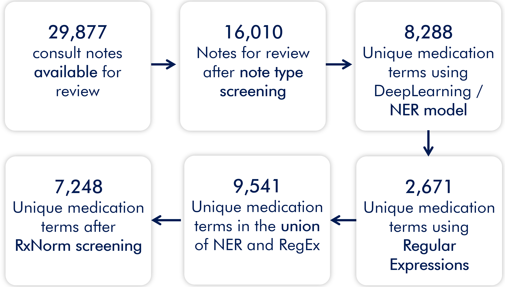

```{r, include=FALSE}
knitr::opts_chunk$set(results = 'asis',
                      echo = FALSE,
                      warning = FALSE,
                      tidy = FALSE,
                      message = FALSE,
                      fig.align = 'center',
                      out.width = "100%")
options(knitr.table.format = "html") 
```

```{r}
library(tidyverse)
library(magrittr)
library(kableExtra)
library(readxl)

med_list <- read_excel("data/med_list.xlsx")

```

# Introduction

According to The Joint Commission, medication names should not be abbreviated as misinterpretation may lead to administration of incorrect medication. Computerized order entry use eliminates this problem for orders, but clinical notes and narratives are still filled with abbreviations.

# Objectives

Identify abbreviated medication names in clinical narratives, using Natural Language Processing, as a first step towards elimination in medical documentation.

# Methods

Retrospective chart review of pediatric ED consult notes at a tertiary pediatric center in 2019. We targeted consult notes due to potential differences in expertise between the documenting and reading providers.

Abbreviated, misspelled and true medication names were identified using 2 Natural Language Processing methods:

1)  named-entity recognition (NER) using a pre-trained model called MED7

2)  Regular Expressions (RegEx) used to identify strings likely to be medications given surrounding text context

# Results


```{r}

```


**Selected Abbreviated Medication Names Found**
```{r medtable}

med_list %>% filter(Count > 11) %>% kable() %>% kable_classic()

```
# Conclusions
Natural Language Processing tools can create libraries of abbreviated medication names used by clinicians. We can then use the output to determine usage frequency and risk of misinterpretation. Abbreviations are not limited to medications; future studies should include more abbreviation types and domain-experts to help interpret domain-specific expressions. Like a spell checker, these libraries could be incorporated into documentation tools in EMR systems to suggest expanded terms.

***Funding Sources***
Alexeev---Biomedical Informatics and Data Science Research Training Program, T15LM007092-30; Ozonoff, Landschaft, Kimia---AHRQ Research Grant 5R01HS026246
