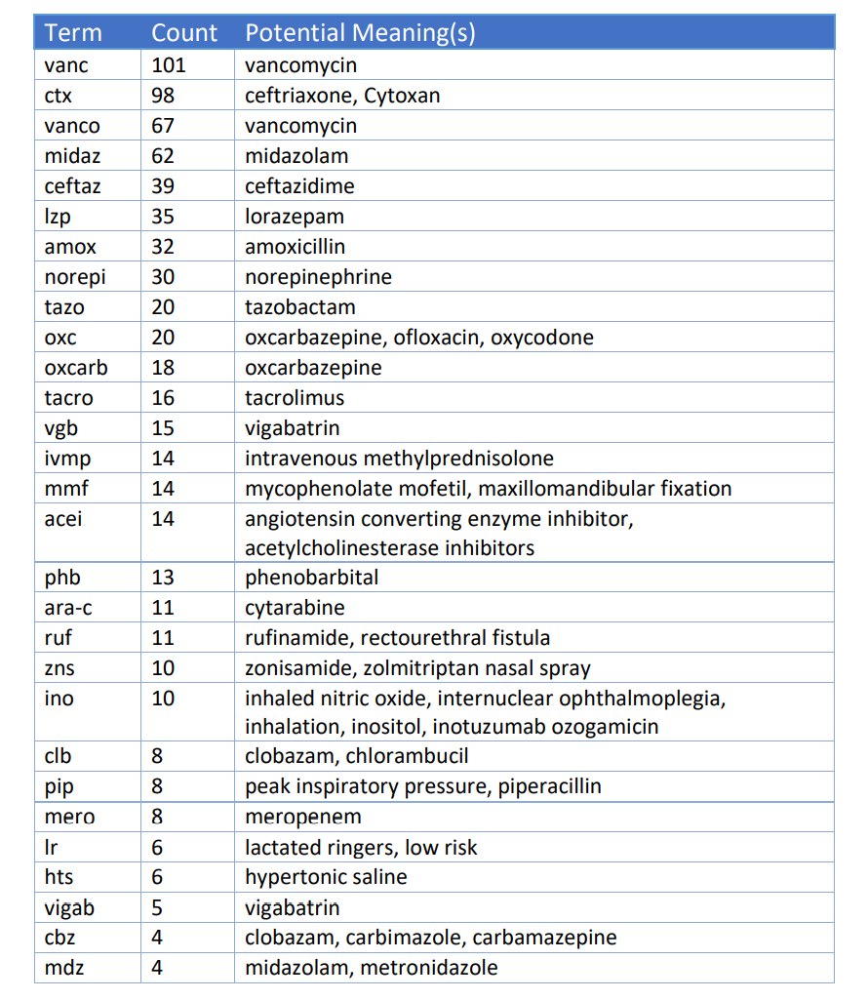

```{r, include=FALSE}
knitr::opts_chunk$set(results = 'asis',
                      echo = FALSE,
                      warning = FALSE,
                      tidy = FALSE,
                      message = FALSE,
                      fig.align = 'center',
                      out.width = "100%")
options(knitr.table.format = "html") 
```


# Introduction

According to The Joint Commission recommendations, medication names should not be abbreviated as misinterpretation may lead to administration of incorrect medication.

## Objectives

1. Identify abbreviated medication names in a first step towards elimination. 

# Methods

Retrospective chart review of pediatric ED consult notes at a tertiary pediatric center in 2019. We targeted consult notes due to potential differences in expertise between the documenting and reading providers. AMNs were identified using 2 NLP methods: a) named-entity recognition (NER) and b) Regular Expressions (RegEx). The NER model was a pre-trained model called MED7, identifying 7 categories: drug names, route of administration, frequency, dosage, strength, form, duration. We fine-tuned the model on a small sample of annotated documents from our hospital. RegEx to identify strings likely to be medications given surrounding text context. 

The abstracted lists were then matched against both generic and commercial medication names using the following lists: RxNorm, National Drug Code Directory (NDCD). The remaining terms were then sorted by frequency, and the top 2,295 were reviewed. 

<br>

# Results

There were 29,877 consult notes available for review. We narrowed the corpus of documents to services more likely to prescribe medication (endocrinology, cardiology, neurology) and eliminated those services where medication treatment is a smaller part of their practice (orthopedics, urology) leaving 16,010 notes for review.  

We identified 8,288 unique medication terms using NER and 2,671 using Regex. The union of the two lists of medications had 9,541 unique medication terms. After cross referencing against RxNorm and NDCD 7,248 unique medication terms remained. After reviewing all terms occurring 2 or more times, a subset of terms, which were identified by an author as likely abbreviated medication names, was curated and is presented with frequency counts in Table 1. 


```{r myprettycode, echo=FALSE,collapse=TRUE, tab.cap='Selected Top Medication Abbreviations', fig.height= 5, out.width="100%"}



```

# Conlusions

NLP provides a novel approach to establish libraries of abbreviated medication names to be eliminated from clinical documentation. Future studies should include domain-expert champions who will help interpret domain-specific expressions beyond the expertise of the informatician
